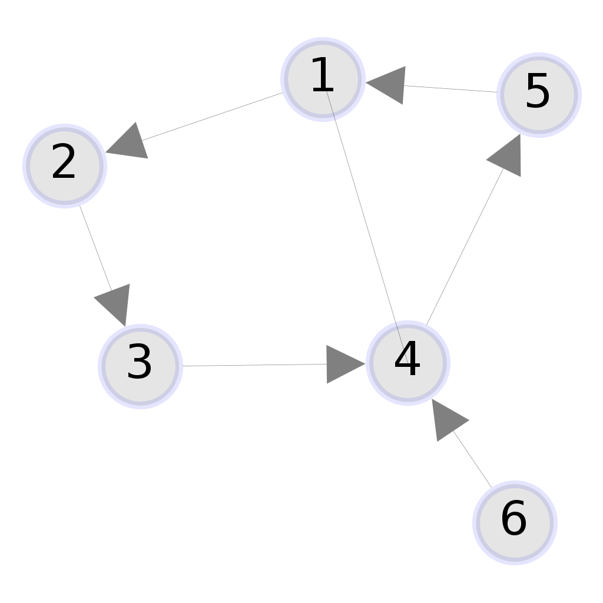

[![Build Status][travis-badge]][travis-link] [![Maven Central][maven-badge]][maven-link] [![Codacy Badge][codacy-abdge]][codacy-link]
# Graph4Scala graphs to Gephi images

Basic conversion tool to visualize **Graph4Scala** graphs with the **Gephi** toolkit.

## Bridging two worlds
Graphs are seamless Scala collections thanks to the excellent [Graph for Scala](https://scala-graph.org/) library by Peter Empen.

Sometimes is needed to quickly visualize them, for example for test purposes.

[Gephi](https://github.com/gephi/gephi) is an award-winning open-source platform for visualizing and manipulating large graphs, with a standalone [toolkit](https://github.com/gephi/gephi-toolkit).

## How to

### Use
Note that two resolvers must be added to access the Gephi Toolkit sources.

#### From a Mill project
```scala
import mill._, scalalib._
import coursier.maven.MavenRepository

object foo extends ScalaModule {
  def repositories = super.repositories ++ Seq(
    MavenRepository("http://bits.netbeans.org/nexus/content/groups/netbeans/"),
    MavenRepository("https://raw.github.com/gephi/gephi/mvn-thirdparty-repo/")
  )
  def ivyDeps = Agg(
    ivy"vision.id::graphgephi:0.1.0"
  )
}
```

#### From an SBT project
```scala
resolvers ++= Seq(
  "NetBeans" at "http://bits.netbeans.org/nexus/content/groups/netbeans/",
  "gephi-thirdparty" at "https://raw.github.com/gephi/gephi/mvn-thirdparty-repo/"
)

libraryDependencies += "vision.id" % "graphgephi" % "0.1.0" classifier "all"
```

### Test
The library is built with [Mill](http://www.lihaoyi.com/mill).

1.  [Install](http://www.lihaoyi.com/mill/#installation) Mill
2.  Open a terminal and `cd` to the repo directory
3.  Use the `mill jvm.test` command to run all tests
4.  Or use the `mill jvm.test.one [testClassName]` command to run a single test class

### Draw a graph
Add the `Drawable` trait to your project and use the `makeImage(g: Graph[N, E], path: String, name: String)` method to draw a **PNG** raster image file or an **SVG** vectorial image file.
> 
> _`Graph(1 ~> 2, 2 ~> 3, 3 ~> 4, 4 ~> 5, 5 ~> 1, 1 ~ 4, 6 ~> 4)`_


[travis-badge]: https://travis-ci.org/mcallisto/scala-graph-to-gephi.svg?branch=master
[travis-link]: https://travis-ci.org/mcallisto/scala-graph-to-gephi
[maven-badge]: https://maven-badges.herokuapp.com/maven-central/vision.id/graphgephi_2.12/badge.svg
[maven-link]: https://maven-badges.herokuapp.com/maven-central/vision.id/graphgephi_2.12
[codacy-abdge]: https://api.codacy.com/project/badge/Grade/10ccdeb613904b878c6eda2f0d82d851
[codacy-link]: https://www.codacy.com/app/mcallisto/scala-graph-to-gephi?utm_source=github.com&amp;utm_medium=referral&amp;utm_content=mcallisto/scala-graph-to-gephi&amp;utm_campaign=Badge_Grade
